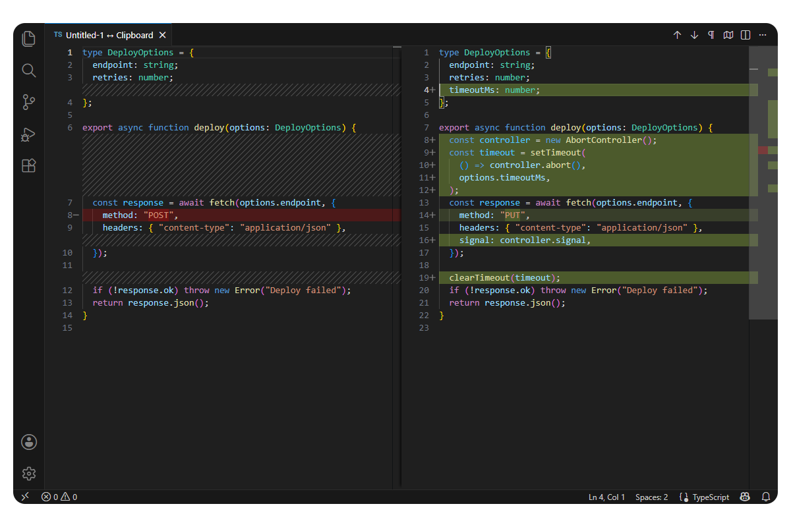

  

# Quick Diff

**Compare selections, buffers, and clipboard text in VS Code's native diff editor**

  
  
  

---

Quick Diff is a small, command-driven bridge to the diff editor already built into VS Code. Comparisons use immutable virtual documents held in memory. There are no temporary files, custom diff views, settings, background scans, or default keybindings.

## Use it

Open the Command Palette and run one of these commands:

| Command | Result |
| --- | --- |
| **Quick Diff: Compare Selection with Clipboard** | Compares every non-empty selection with plain text from the clipboard. |
| **Quick Diff: Use Selection as Left Side** | Captures the selected text as an immutable left snapshot. |
| **Quick Diff: Compare Selection with Left Side** | Compares the current selection with the captured left snapshot. |
| **Quick Diff: Compare File with Clipboard** | Compares the complete in-memory buffer, including unsaved edits, with the clipboard. |
| **Quick Diff: Compare Open Files...** | Uses two native Quick Picks, then compares the selected open text documents. |

The editor context menu contains only **Compare Selection with Clipboard**. The other commands stay in the Command Palette to keep the editor menu quiet.

## Exact behavior

- Empty selections and empty clipboard text are rejected instead of being guessed.
- Multiple selections are ordered by document position and joined with the document's EOL sequence.
- Overlapping selections are combined; adjacent selections remain separate.
- Duplicate filenames are disambiguated with compact workspace-relative labels.
- Diff titles never include source text or absolute paths.
- Plain-text clipboard behavior follows VS Code and the host operating system; binary clipboard data is outside scope.

## Privacy and limits

Compared text stays in extension-host memory. Quick Diff has no telemetry, network calls, persistence, clipboard watcher, or filesystem writes. It keeps at most 16 snapshots, expires unreferenced snapshots after 30 minutes, and clears everything when the extension deactivates.

Each source is measured as UTF-8. Quick Diff asks before comparing text larger than 2 MiB and rejects text larger than 16 MiB. It never truncates content.

## Compatibility

Quick Diff ships Node and browser bundles and supports desktop, web, virtual workspaces, Restricted Mode, and remote extension hosts on VS Code 1.134 or newer.

## Troubleshooting

- No diff opens: make a non-empty selection or copy non-empty plain text first.
- **Compare Selection with Left Side** reports no left side: run **Use Selection as Left Side** again in the current window.
- An open file is missing from the picker: open it in an editor tab first.
- A large comparison is rejected: split it into smaller text sources; the 16 MiB limit cannot be overridden.

Development and verification commands are documented in [docs/development.md](docs/development.md).

---

  
  <a href="https://github.com/gvastethecreator"><picture><source media="(prefers-color-scheme: dark)" srcset="https://shieldcn.dev/badge/follow%20me-/gvastethecreator.png?size=xs&amp;logo=github&amp;brand=github&amp;mode=dark"></picture></a>
  <a href="https://github.com/sponsors/gvastethecreator"><picture><source media="(prefers-color-scheme: dark)" srcset="https://shieldcn.dev/badge/support%20this-project.png?size=xs&amp;logo=ri%3APiHeartFill&amp;logoColor=b85a90&amp;brand=github&amp;mode=dark"></picture></a>

